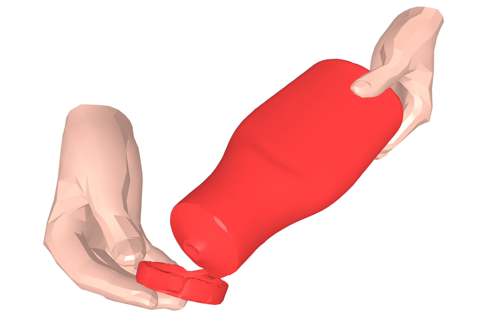
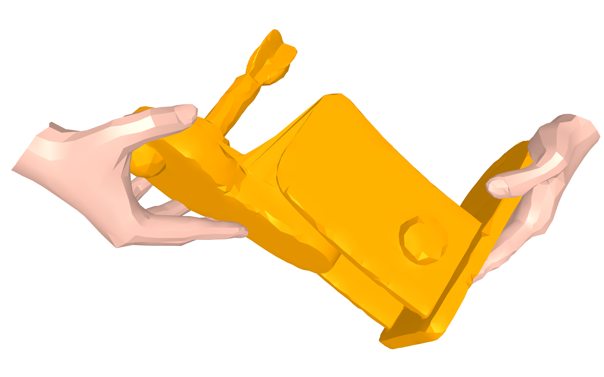
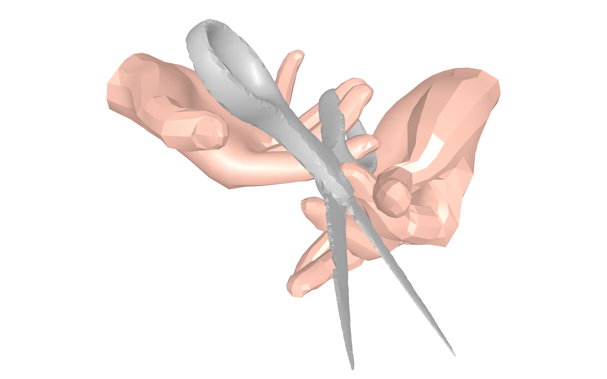

# ARCTIC 🥶 Hands & Object Viewer

This repository allows you to easily render **hand-object interactions** in 3D from the [ARCTIC](https://arctic.is.tue.mpg.de/) dataset. Pick a raw data sequence and a frame number and interactively explore the 3D scene in detail!



## Requirements

The [ARCTIC](https://github.com/zc-alexfan/arctic) dataset and codebase are what this repository is based on. In particular, it requires having a copy of the dataset and models in the `/data` folder, which can be obtained following the instructions [here](https://github.com/zc-alexfan/arctic/tree/master#getting-started). Credits to the original work.

To run the viewer, first install the environment and packages:
```bash
conda create -n arctic_viz python=3.10
conda activate arctic_viz
pip install -r requirements.txt
```
Then download some scripts from the arctic repository:
```bash
chmod +x ./bash/*.sh
./bash/download_scripts.sh
```
After, modify `smplx` package to return 21 joints instead of 16:
```bash
vim /home/<user_name>/anaconda3/envs/arctic_viz/lib/python3.10/site-packages/smplx/body_models.py

# uncomment L1681
joints = self.vertex_joint_selector(vertices, joints)
```
Finally, copy the previously prepared `/data` folder into the current directory. If the repository structure looks like this, you are ready to go!
```
.
├── bash/
├── common/
├── data/
├── README.md
├── requirements.txt
├── res/
├── src/
└── utils/
```

## Usage

To render a scene, provide the path to a raw **.mano.npy** sequence and a valid **frame number** to the `hands_object_viewer.py` script.
```
usage: hands_object_viewer.py [-h] [-m MANO_P] [-f FRAME]

options:
  -h, --help            show this help message and exit
  -m MANO_P, --mano_p MANO_P
                        Path to raw .mano.npy sequence to process
  -f FRAME, --frame FRAME
                        Frame number to visualize
```
For example, try:
```bash
python src/hands_object_viewer.py --mano_p ./data/arctic_data/data/raw_seqs/s01/laptop_use_01.mano.npy --frame 250
```


## References

[1] Fan et al., "ARCTIC: A Dataset for Dexterous Bimanual Hand-Object Manipulation", http://download.is.tue.mpg.de/arctic/arctic_april_24.pdf  
[2] ARCTIC 🥶: A Dataset for Dexterous Bimanual Hand-Object Manipulation, https://github.com/zc-alexfan/arctic